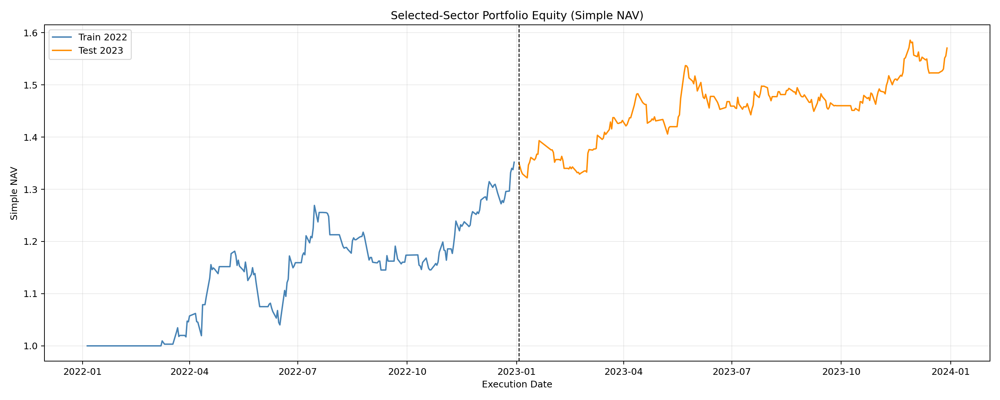
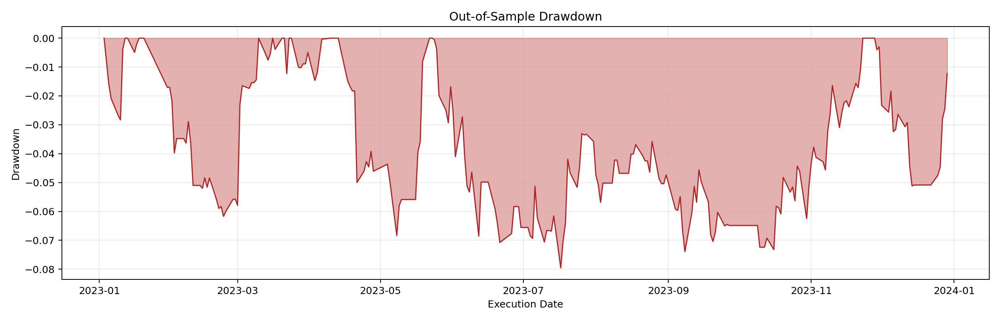

# Futures Multi-Factor Sector Backtest

A compact Python research project for building and evaluating a daily futures
portfolio from minute-level TWAP data. The workflow trains one parameter set per
sector, ranks sectors using the training sample only, and evaluates the selected
portfolio on a held-out period.

> This is a sanitized portfolio version. The original dataset, source materials,
> detailed trade records, personal information, and organization identifiers are
> not included. The code is for research and education only, not investment advice.

## Highlights

- Four signals: trend, volatility compression, intraday range, and rolling z-score
- Sector-level grid search using the training period only
- Held-out out-of-sample evaluation
- Equal-weight or inverse-volatility portfolio construction
- Commission and optional slippage deductions
- Sharpe ratio, Calmar ratio, drawdown, win rate, and transaction statistics
- Deterministic synthetic data generator for a reproducible public demo

## Research flow

```text
minute TWAP data
      |
      v
daily OHLC-style TWAP aggregation
      |
      v
four lagged factors -> long / short / flat signals
      |
      v
sector-level parameter search on train sample
      |
      v
top-sector portfolio -> held-out test evaluation
```

The signal is deliberately lagged. Under the default setting, a trade executed
on day `T` uses factor information from `T-2`, which avoids using future data in
the decision rule.

## Repository layout

```text
.
|-- assets/                         # Sanitized aggregate charts
|-- docs/methodology.md             # Model assumptions and limitations
|-- generate_demo_data.py           # Reproducible synthetic input data
|-- hfq_twap_data_and_signals.py    # Data, factors, signals, basic metrics
|-- sector_filter_backtest.py       # Training, sector selection, test evaluation
|-- requirements.txt
`-- README.md
```

## Quick start

```bash
python -m venv .venv

# Windows PowerShell
.venv\Scripts\Activate.ps1

# macOS / Linux
source .venv/bin/activate

pip install -r requirements.txt
python generate_demo_data.py
python sector_filter_backtest.py
```

The demo generator creates artificial data only. Its output is ignored by Git,
so neither source data nor generated records can be committed by accident.

To use your own data, place one CSV or Feather file per symbol under
`data/market_data_01min/`. Each file must contain the following columns. Feather
input additionally requires `pyarrow`.

| Column | Meaning |
| --- | --- |
| `tradeDate` | Trading date |
| `hfq_twap` | Intraday adjusted TWAP observation |

Accepted names are `<SYMBOL>_main.csv` and `<SYMBOL>_main.feather`.
The optional `plot_equity_curve` helper additionally requires `matplotlib`.

## Historical research snapshot

The following charts are aggregate outputs from one historical experiment. They
are included to demonstrate the analysis workflow; exact reproduction requires
the original licensed dataset, which is intentionally excluded.





## Important limitations

- The implementation is a research prototype, not a production trading engine.
- Contract rolls, margin, limit moves, liquidity, and market impact are simplified.
- Grid-search results can overfit even when test data is not used for selection.
- Historical or synthetic performance does not imply future returns.

See [docs/methodology.md](docs/methodology.md) for additional details.
